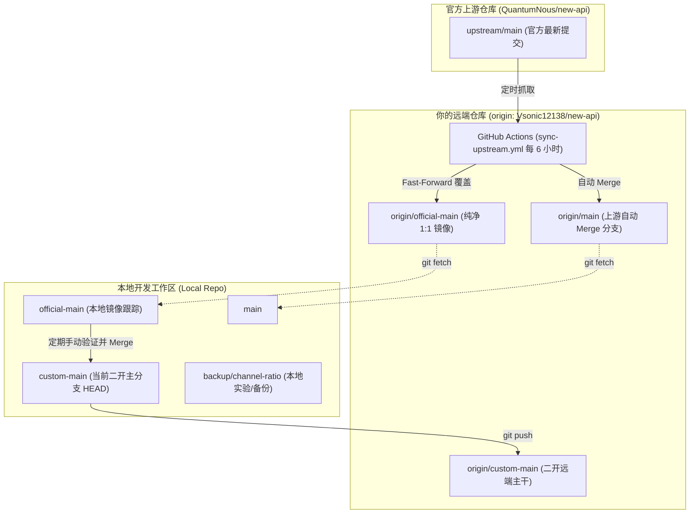

# new-api 二开分支拓扑与协作规范 (Branches Architecture)

本文档明确定义当前项目的分支拓扑结构、各分支的定位与职责、自动化同步机制，以及日常二开与跟进官方主线的标准操作流程（SOP）。

---

## 一、 整体拓扑架构

当前项目基于 Fork 模式进行二次开发与主线持续维护，整体仓库与分支关系如下：



---

## 二、 各分支职责与定位

### 1. `custom-main`（当前开发与部署主分支）
* **定位**：**二开的核心分支**，承载了所有的定制化功能、UI 优化及构建体系改造。
* **特性**：
  - 拥有自定义构建逻辑（`scripts/resolve-version.sh`）、双 Tab 系统更新、发卡网横幅及默认主题预设。
  - 保持与官方主干高频平滑合并，确保拥有上游最新的安全补丁和功能特性。
* **规则**：所有日常的二开编码、测试与本地运行均基于此分支开展。

### 2. `official-main`（官方纯净镜像分支）
* **定位**：**官方主线在 Fork 仓库中的 1:1 镜射锚点**。
* **特性**：
  - **绝不包含任何二开代码**。
  - 由远端工作流 `.github/workflows/sync-upstream.yml` 每 6 小时自动与官方 `upstream/main` 保持强一致（强制对齐）。
* **规则**：该分支仅作为本地拉取官方最新代码的基准参照，禁止直接在该分支上修改或提交非官方代码。

### 3. `main`（上游平滑中转分支）
* **定位**：Fork 默认保留的主分支。
* **特性**：
  - 由 GitHub Actions 工作流在每次同步 `official-main` 后，自动以 `git merge` 方式合入上游变更，用于向后兼容标准 Fork 流程。

### 4. `backup/channel-ratio`（本地实验/备份分支）
* **定位**：**特定功能草稿备份分支**。
* **特性**：
  - 保存了此前针对渠道倍率（`channel-ratio`）计算与阶梯计费相关的本地试验性改动（包含部分后端 model/service 及前端 channel 表格改动）。
* **规则**：作为离线备份参考，不直接参与日常主分支部署。

---

## 三、 自动化上游同步机制 (`sync-upstream.yml`)

为避免 Fork 仓库落后官方主线，仓库内置了全自动同步守护工作流：

### 1. 触发周期
* **定时任务**：每 6 小时自动触发一次（Cron: `17 */6 * * *`）。
* **手动触发**：支持在 GitHub Actions 页面随时手动点击 `Run workflow`。

### 2. 工作原理
1. **鉴权**：使用预先配置在 Secrets 中的 `UPSTREAM_SYNC_TOKEN`（带有 `repo` 和 `workflow` 作用域的 PAT），突破 GitHub 默认对修改工作流文件的权限拦截。
2. **抓取上游**：连接 `https://github.com/QuantumNous/new-api.git` 抓取最新的 `main`。
3. **更新镜像**：将 `origin/official-main` 强制对齐到 `upstream/main`（无任何差异）。
4. **合并主线**：尝试将最新变更合并至 `origin/main`。

---

## 四、 标准二开与主线合并操作流程 (SOP)

为了确保二开分支长期健康、永远不与官方主线走散，建议遵循以下标准操作规范：

### 流程 A：拉取并合并官方最新版本（日常推荐）

当官方发布了新的 Release 或重要修复时：

```bash
# 1. 确保当前处于 custom-main 且工作区干净
git checkout custom-main
git status

# 2. 从远端拉取最新自动同步好的官方镜像
git fetch origin official-main:official-main

# 3. 将官方最新更新合入二开分支
git merge official-main -m "chore: merge official-main into custom-main"

# 4. 如遇冲突（通常仅 locales/*.json），解决冲突后提交
# 5. 运行快速验证
cd relaykit && GOWORK=off go build ./... && cd ..
GOWORK=off go build -o /dev/null .
./scripts/resolve-version.sh

# 6. 推送至 GitHub
git push origin custom-main
```

### 流程 B：向官方仓库贡献代码（提 PR）

若需要向官方提交通用 Bug 修复或通用特性，**切勿使用 `custom-main` 直接提 PR**：

```bash
# 1. 基于干净的 official-main 创建独立的特性分支
git checkout -b fix/your-feature-name official-main

# 2. 在该分支上完成原子性修改与针对性测试
# 3. 推送到个人 Fork 仓库
git push -u origin fix/your-feature-name

# 4. 在 GitHub 页面向 QuantumNous/new-api:main 发起 Pull Request
```
