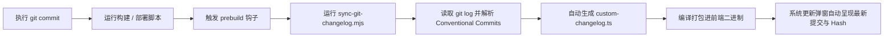

# Git Commit 规范与二开日志自动同步指南

> **文档版本**: 1.0  
> **制定日期**: 2026-10-03  
> **适用范围**: `new-api` 二开主干分支（`custom-main`）及日常研发协作

---

## 一、 为什么必须规范 Commit 信息？

在我们的二开架构中，**Git Commit 不仅是代码变更记录，也是【系统更新】二开日志的自动数据源**：

1. **自动发布日志驱动**：前端构建系统（`prebuild` 钩子）会自动运行 `scripts/sync-git-changelog.mjs`，从 Git 历史中自动解析 Commit 提交信息，并实时生成前端展示的【二开定制日志】。
2. **分类徽章自动推导**：自动化脚本会根据 Commit 的 `type` 前缀（`feat`、`fix`、`perf`、`chore`），在管理后台的“系统更新”弹窗中自动打上对应的状态颜色徽章。
3. **长期可维护性**：在持续拉取官方上游更新（Upstream Merge）时，规范的 Commit 记录能让合流冲突审查与功能回溯一目了然。

---

## 二、 Commit 格式标准

我们采用业界通用的 **Conventional Commits** 规范：

```text
<type>(<scope>): <subject>

[可选的详细正文描述 body]
[可选的关联 Issue / PR 编号]
```

### 示例速览
* `feat(home): embed official ZCode setup screenshots with lightbox`
* `fix(i18n): fix translation namespace structure in 7 locales`
* `perf(home): eliminate scroll lag by cleaning static will-change`
* `chore(merge): merge official-main v1.0.0-rc.41 into custom-main`

---

## 三、 Type（变更类型）规范

| Type | 中文含义 | 适用场景 | 系统更新展示徽章 |
|:---|:---|:---|:---:|
| **`feat`** | 新功能 / 新特性 | 新增组件、新客户端适配、新模型支持、业务功能落地 | 黑色/主题高亮 `FEAT` |
| **`fix`** | 缺陷修复 | 解决界面崩溃、i18n 缺失、路由 404、计费与逻辑错误 | 黄色/警示 `FIX` |
| **`perf`** | 性能优化 | 消除卡顿、减少渲染重绘、内存优化、编译与加载提速 | 绿色/加速 `PERF` |
| **`chore`** | 日常维护 / 构建工具 | 依赖升级、同步官方上游（merge）、更新构建脚本等 | 灰色/中性 `CHORE` |
| **`refactor`** | 代码重构 | 内部结构调整，不改变外部业务行为也非修 bug | 灰色/中性 `CHORE` |
| **`docs`** | 文档更新 | `my_docs/` 规划、架构说明、设计规范撰写 | 灰色/中性 `CHORE` |

---

## 四、 Scope（影响范围）规范

为了让团队和用户快速定位改动模块，括号中的 `scope` 建议严格统一为以下模块标识之一：

| Scope | 对应系统模块 / 路径 | 典型说明 |
|:---|:---|:---|
| **`home`** | `web/src/features/home/` | 首页落地页、客户端指引、模型展示墙等 |
| **`relay`** | `relay/`、`relaykit/` | 接口转发、协议转换、流式处理 |
| **`pricing`** | `web/src/features/pricing/`、`model/pricing*` | 模型定价、阶梯费率、倍率展示 |
| **`wallet`** | `web/src/features/wallet/` | 钱包充值、官方发卡网直达横幅、兑换码 |
| **`keys`** | `web/src/features/keys/` | 令牌生成、API Key 细粒度权限管理 |
| **`i18n`** | `web/src/i18n/` | 多语言字典翻译、命名空间同步 |
| **`system-update`** | `web/src/features/system-update/` | 系统更新弹窗、二开更新日志 |
| **`theme`** | `web/src/styles/` | 主题预设、圆角、深浅色模式 |
| **`merge`** | 根目录 Git 操作 | 合并官方主干代码与冲突解决 |
| **`ci`** | `.github/workflows/` | GitHub Actions 持续集成与镜像打包 |

---

## 五、 Subject（简短摘要）撰写要点

1. **祈使语气，直奔主题**：
   - ✅ `feat(home): add official ZCode logo and quick setup guide`
   - ❌ `feat: added some icons and fixed stuff`
2. **语言推荐**：
   - 英文（推荐与开源生态规范一致，自动化日志双语友好）或清晰简明的中文：
   - ✅ `feat(models): refine featured models wall to 6 flagship drivers`
   - ✅ `feat(models): 精简热门模型展示墙为 6 款主力旗舰`
3. **字数控制**：
   - 简短摘要建议控制在 **50 ~ 72 个字符** 内，过长的详细说明可换行写在正文（Body）中。

---

## 六、 自动化同步与工作流机制

在二开分支中，我们已经将自动化流水线完全挂载到了前端构建生命周期中：



每次你执行 `git commit` 后，在进行编译和部署时，**无需手动修改任何文件，系统会自动捕获本次提交内容并呈现给系统更新栏！**
