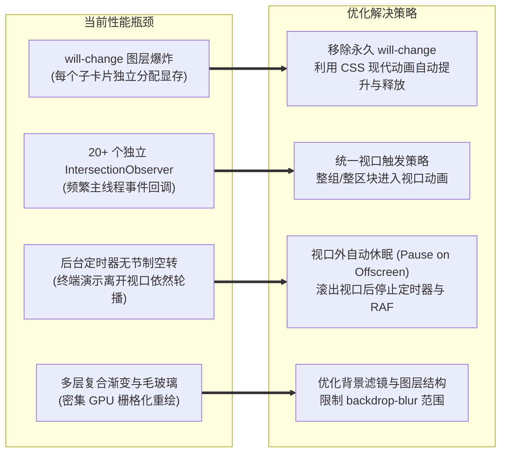

# 首页现代化重构与体验优化实施规划 (Home Page Enhancement Plan)

本文档针对当前项目首页（Landing Page）存在的**滑动性能卡顿**、**功能展示缺乏实用转化**以及**客户端配置门槛高**等问题，制定系统化的技术改造与 UI 增强规划方案。

---

## 一、 规划背景与核心诉求

1. **流畅度痛点**：目前页面在向下滚动时存在明显的丢帧和顿挫感，尤其在中低配设备、轻薄本及移动端浏览器上表现突出，严重影响第一印象。
2. **商业化与易用性脱节**：
   - 首页缺乏与官方自动发卡网的直达联动，新访客无法在首屏快速获取兑换码/购买额度。
   - 缺乏对主流开发客户端（ZCode、Cherry Studio 等）的一键配置指引与 Base URL 复制，开发者接入流程较长。
   - 官方原版的特性介绍均为抽象概念（如“毫秒响应”、“安全可靠”），缺乏开发者最为关心的**热门模型矩阵（DeepSeek-R1 / V3、Claude 3.7、GPT-4o 等）展示墙**。
3. **二开架构约束**：代码必须高度简洁解耦，保持**最小侵入性**，绝不破坏现有官方主线组件逻辑，确保未来可以无缝同步合并官方上游代码。

---

## 二、 首页性能调优方案：彻底告别滑动卡顿

经过前期的代码审查，我们定位到了导致滑动卡顿的 4 个核心技术瓶颈，本次规划针对性施策：



### 1. 消除 GPU 合成层爆炸 (Layer Squashing)
* **现状**：`web/src/components/animate-in-view.tsx` 对每一个子节点强行添加了 `will-change-[transform,opacity]`，导致 Bento 栅格的几十个元素同时常驻显存。
* **改造**：移除静态常驻的 `will-change`，仅在 CSS `@keyframes` 运行的 0.6s 内由浏览器渲染引擎自动提升为复合层，动画完成后立即回归普通文档流，显存占用降低 80% 以上。

### 2. 视口外后台空转休眠 (Off-screen Pausing)
* **现状**：首屏右侧的 `HeroTerminalDemo`（终端 API 请求演示）无论用户是否滚过，每 4.5 秒都会执行 `setInterval` 并在后台触发组件重新渲染。
* **改造**：为 `HeroTerminalDemo` 增加视口交叉感知（Intersection Observer）。当组件滚出屏幕可视区（如向上滑出）时，立即暂停内部定时器；重新滚回视口时无缝恢复，彻底消除滚动过程中的主线程渲染争抢。

### 3. 精简多余的微观动画
* **改造**：对于网格内的各个子卡片，不再让每个微小图标都各自绑定一个独立的 Observer，改为**外层容器统一触发淡入**（CSS 级联 delay），大幅减少 JS 运行开销。

---

## 三、 功能与业务模块增强设计

设计风格全面对齐 **Linear / Vercel** 的现代极简科技风格，采用精致的边框微光、微阴影、品牌色渐变以及清晰的信息架构。

### 1. 官方发卡网直达联动 (Official Card Shop Banner & Quick Action)

* **设计定位**：在首屏 Hero 区域与操作区，为新访客与普通用户提供最显眼的充值与额度获取入口。
* **业务联动机制**：
  - 后端复用已有的 `common.TopUpLink`（管理员在后台系统设置中配置的发卡网地址），在公开接口 `/api/status` 中暴露。
  - 前端通过已缓存的 `useStatus()` 获取 `status.topup_link`。
  - **展示形式**：
    1. **Hero 快速购买按钮**：在未登录用户的操作区（`Get Started` 旁边），若系统配置了发卡网，增加带光效的 `[在线购买额度 / 发卡网]` 直达按钮。
    2. **微光通知胶囊 (Announcement Pill)**：在 Hero 顶部提供“💡 官方自动发卡网已上线，24 小时全自动发货，即买即用”的高质感横幅。

### 2. 快速客户端接入配置卡片 (Quick Client Configuration)

为了解决开发者“拿到了 API 却不知道去哪里用、怎么配”的问题，在 Hero 下方提供现代官网级别的**客户端即插即用配置卡片**。

```
┌────────────────────────────────────────────────────────────────────────┐
│  ⚡ 快速接入与客户端支持 (Quick Integration)                             │
│                                                                        │
│  [复制当前 Base URL: https://api.yourdomain.com/v1 ]  [一键复制密钥/前往后台]│
│                                                                        │
│  ┌───────────────────────┐  ┌───────────────────────┐                 │
│  │ 🔷 ZCode (代码助手)    │  │ 🍒 Cherry Studio     │                 │
│  │ 沉浸式编程与深度推理协作 │  │ 全能桌面级多模型多工作区│                 │
│  │ [一键复制适配配置]    │  │ [一键填入配置 / 官网]  │                 │
│  └───────────────────────┘  └───────────────────────┘                 │
└────────────────────────────────────────────────────────────────────────┘
```

* **ZCode 配置卡片**：
  - **定位**：专注于程序员编程、代码补全、重构与 Agent 场景。
  - **交互**：提供直观的配置步骤说明（Base URL + 密钥填入），支持一键点击复制针对 ZCode 预设的标准 JSON 配置。
* **Cherry Studio 配置卡片**：
  - **定位**：全平台优雅的多模型桌面聊天与知识库客户端。
  - **交互**：展示 Cherry Studio 官方专属 Logo，提供官网下载直达链接与一键复制 NewAPI 适配 Provider 格式。
* **一键复制 Base URL 状态条**：
  - 自动读取当前站点域名并拼装 `/v1`（如 `https://api.example.com/v1`），支持点击一键复制并附带 Toast 提示。
  - 附带绿色健康心跳指示点（`● 所有中继集群运行正常`）。

### 3. 热门模型展示墙 (Featured Models Showcase)

摒弃空泛的营销文字，直接展示开发者最关心、最核心的高价值模型，采用 Bento Grid 网格与高质感分类标签。

```
┌────────────────────────────────────────────────────────────────────────┐
│  🔥 旗舰模型支持矩阵 (Featured Model Matrix)                             │
│  [ 全部 (All) ]  [ 深度推理 (Reasoning) ]  [ 编程旗舰 (Coding) ]  [ 视觉多模态 ] │
│                                                                        │
│  ┌──────────────────┐  ┌──────────────────┐  ┌──────────────────┐      │
│  │ 🐋 DeepSeek-R1   │  │ 🎭 Claude 3.7    │  │ ⚡ GPT-4o        │      │
│  │ 深度思考 · 极低成本│  │ 混合思考 · 顶级编程│  │ 旗舰多模态 · 全能基座│      │
│  │ 128K 上下文      │  │ 200K 上下文      │  │ 128K 上下文      │      │
│  │ [点击复制模型名]  │  │ [点击复制模型名]  │  │ [点击复制模型名]  │      │
│  └──────────────────┘  └──────────────────┘  └──────────────────┘      │
│  ┌──────────────────┐  ┌──────────────────┐  ┌──────────────────┐      │
│  │ 🧠 DeepSeek-V3   │  │ ⚡ Gemini 2.5    │  │ 💻 Qwen 2.5 Coder│      │
│  │ 极速日常对话与代码│  │ 百万超长上下文    │  │ 本地化极致代码微调│      │
│  └──────────────────┘  └──────────────────┘  └──────────────────┘      │
└────────────────────────────────────────────────────────────────────────┘
```

* **收录核心模型**：
  - **DeepSeek 旗舰**：`deepseek-reasoner` (R1 推理)、`deepseek-chat` (V3 通用)
  - **Anthropic 旗舰**：`claude-3-7-sonnet` (混合思考)、`claude-3-5-sonnet`
  - **OpenAI 旗舰**：`gpt-4o`、`o3-mini` / `o1`
  - **Google 旗舰**：`gemini-2.5-flash` (超快超长上下文)
* **展示要素**：
  - 厂商专属品牌色与 Logo
  - 模型技术亮点与上下文长度标签
  - **点击一键复制精确模型名**（防止用户在客户端手动输入时打错型号代码）
  - 前往价格页查看详细倍率的直达链接

---

## 四、 低耦合二开架构与防主线冲突设计

为了确保本次二开改动**绝对不会影响后续合并官方主线**，我们采取完全解耦的组件化挂载策略：

```
web/src/features/home/
├── components/
│   ├── sections/              # 官方原版区块（尽量不改动或只做最轻量挂载）
│   │   ├── hero.tsx           # 仅挂载发卡网快捷按钮与链接引用
│   │   ├── features.tsx       # 原特性区
│   │   └── ...
│   │
│   └── custom/                # 🌟 全新独立的二开专属目录（与官方完全隔离）
│       ├── index.ts           # 统一导出
│       ├── client-guide-card.tsx    # ZCode & Cherry Studio 快速配置卡片
│       ├── featured-models-wall.tsx # 热门模型展示墙
│       └── card-shop-link-card.tsx  # 发卡网专属卡片/横幅
│
└── index.tsx                  # 首页入口（仅新增 2 行挂载二开组件）
```

### 为什么这样做可以保证零冲突？
1. **新增独立目录**：所有的二开 UI、交互和数据逻辑均封装在 `custom/` 目录下，官方主线不存在这个目录，Git 在拉取官方更新时完全不会感知。
2. **入口轻量插拔**：在 `web/src/features/home/index.tsx` 中，二开组件就像插件一样直接在区块之间插拔式引用：
   ```tsx
   <Hero isAuthenticated={isAuthenticated} />
   <FeaturedModelsWall />      {/* 二开新增热门模型墙 */}
   <ClientGuideCard />         {/* 二开新增客户端指引 */}
   <Stats />
   <Features />
   <HowItWorks />
   <CTA isAuthenticated={isAuthenticated} />
   ```
3. **多语言词条安全机制**：所有新词条使用统一的命名规范，便于在 `locales/*.json` 冲突时以一目了然的方式合并。

---

## 五、 实施路线图与验收标准

| 阶段 | 核心任务 | 交付产物 | 验收指标 |
|:---|:---|:---|:---|
| **Phase 1** | **性能卡顿攻坚** | 优化 `animate-in-view`，给 `HeroTerminalDemo` 增加视口外感知 | 页面上下滚动达 60/120 FPS，显存占用降低，终端组件在屏幕外停止触发重绘 |
| **Phase 2** | **发卡网联动增强** | 首屏 Hero 注入发卡网购买胶囊与主按钮，支持系统后台配置联动 | 若后台配置了 `topup_link` 则自动展示，未配置则优雅隐藏 |
| **Phase 3** | **客户端接入卡片** | 新增 `ClientGuideCard`（ZCode、Cherry Studio、Base URL 复制） | 复制功能可用并弹出 Toast，多语言支持完备，深浅色主题自适应 |
| **Phase 4** | **热门模型展示墙** | 新增 `FeaturedModelsWall`（DeepSeek、Claude、OpenAI 等） | 卡片支持分类筛选、点击复制模型名称、动画流畅精致 |
| **Phase 5** | **工程验证与文档** | 前端打包验证、主线合并兼容性检查、更新 commit 记录 | `bun run build` 成功无报错，独立模块无跨层依赖 |

---

## 六、 结论与后续步骤

本方案在保持二开架构高度纯净、低耦合的前提下，同时解决了**视觉卡顿**与**商业/开发易用性**两大核心痛点。当前规划文档已归档在项目文档库，后续可按照各阶段规划稳步实施。
